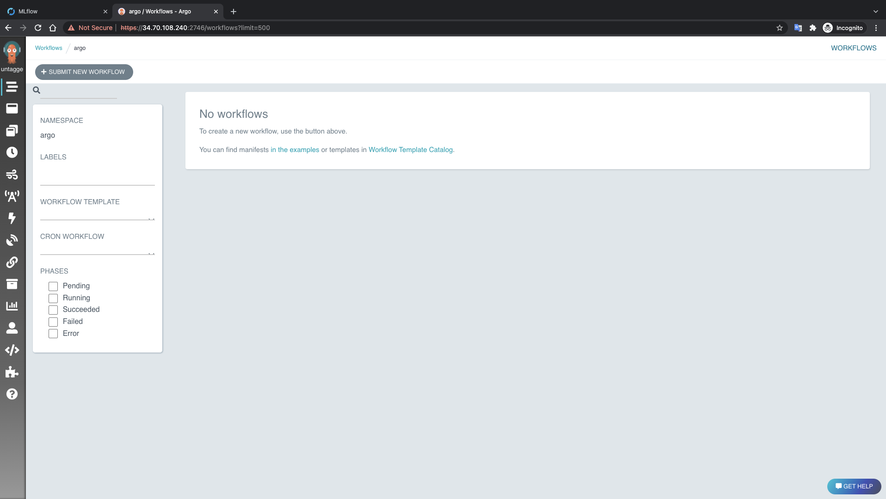

# Installation on Minikube

# Let’s Try Install everything and test an example

With this installation you can conveniently run through the tutorial directly on a laptop assuming it has enough resources. It has been tested on a 4 cores machine, `x86-64`  architecture with 16GB RAM. Minikube provides a single-node local cluster, so this installation is meant just for testing purposes.

> This is not the final installation and this only for demo purpose !
> 

## Installing Minikube

minikube is local Kubernetes, focusing on making it easy to learn and develop for Kubernetes.

All you need is Docker (or similarly compatible) container or a Virtual Machine environment, and Kubernetes is a single command away: `minikube start`

### What you’ll need

- 4 CPUs
- 16GB of free memory
- 40GB of free disk space
- Internet connection
- Container or virtual machine manager, such as: [Docker](https://minikube.sigs.k8s.io/docs/drivers/docker/), [Hyperkit](https://minikube.sigs.k8s.io/docs/drivers/hyperkit/), [Hyper-V](https://minikube.sigs.k8s.io/docs/drivers/hyperv/), [KVM](https://minikube.sigs.k8s.io/docs/drivers/kvm2/), [Parallels](https://minikube.sigs.k8s.io/docs/drivers/parallels/), [Podman](https://minikube.sigs.k8s.io/docs/drivers/podman/), [VirtualBox](https://minikube.sigs.k8s.io/docs/drivers/virtualbox/), or [VMware Fusion/Workstation](https://minikube.sigs.k8s.io/docs/drivers/vmware/)

### Installation

Click on the buttons that describe your target platform. For other architectures, see [the release page](https://github.com/kubernetes/minikube/releases/latest) for a complete list of minikube binaries.

To install the latest minikube **stable** release on **ARM64 or** **x86-64** using **binary download**:

```bash
curl -LO https://storage.googleapis.com/minikube/releases/latest/minikube-linux-amd64
sudo install minikube-linux-amd64 /usr/local/bin/minikube
```

### Start your cluster

From a terminal with administrator access (but not logged in as root), run:

```
minikube start --driver=docker --memory 16384 --cpus 4
```

If minikube fails to start, see the [drivers page](https://minikube.sigs.k8s.io/docs/drivers/) for help setting up a compatible container or virtual-machine manager.

### Interact with your cluster

If you already have kubectl installed, you can now use it to access your shiny new cluster:

Alternatively, minikube can download the appropriate version of kubectl and you should be able to use it like this:

You can also make your life easier by adding the following to your shell config:

```
alias kubectl="minikube kubectl --"

```

Initially, some services such as the storage-provisioner, may not yet be in a Running state. This is a normal condition during cluster bring-up, and will resolve itself momentarily. For additional insight into your cluster state, minikube bundles the Kubernetes Dashboard, allowing you to get easily acclimated to your new environment:

```
minikube dashboard
```

Tada! Your application is now available at [http://localhost:7080/](http://localhost:7080/).

You should be able to see the request metadata from nginx such as the `CLIENT VALUES`, `SERVER VALUES`, `HEADERS RECEIVED` and the `BODY` in the application output. Try changing the path of the request and observe the changes in the `CLIENT VALUES`. Similarly, you can do a POST request to the same and observe the body show up in `BODY` section of the output.

```bash
kubectl proxy --address='0.0.0.0' --accept-hosts='^*$'
```

## Install Argo Workflows

To get started quickly, you can use the quick start manifest which will install Argo Workflow as well as some commonly used components:

These manifests are intended to help you get started quickly. They are not suitable in production, on test environments, or any environment containing any real data. They contain hard-coded passwords that are publicly available.

```bash
kubectl create ns argo
kubectl apply -n argo -f https://raw.githubusercontent.com/argoproj/argo-workflows/master/manifests/quick-start-postgres.yaml
```

```bash
kubectl create clusterrolebinding safoinme-cluster-admin-binding --clusterrole=cluster-admin --user=safoinme@gmail.com
```

If you are running Argo Workflows locally (e.g. using Minikube or Docker for Desktop), open a port-forward so you can access the namespace:

```bash
kubectl -n argo port-forward deployment/argo-server 2746:2746
```

This will serve the user interface on https://localhost:2746

If you're using running Argo Workflows on a remote cluster (e.g. on EKS or GKE) then [follow these instructions](https://argoproj.github.io/argo-workflows/argo-server/#access-the-argo-workflows-ui).

Next, Download the latest Argo CLI from our [releases page](https://github.com/argoproj/argo-workflows/releases/latest).



## Create and Setup Nginx-Ingress

To setup Nginx-Ingress we need to use the yaml files in the Nginx-Ingress folder! The Nginx-Ingress-NodePort is modified from documentation file to work on NodePort instead of LoadBalancer

```bash
kubectl apply -f nginx-ingress-NodePort.yaml
```

then we will deploy a default backend deployment and service for our nginx-ingres

## Create and Setup ML Namespace

First we need is create a new Namespace under the name ML. we can do this using the yaml files in the namespace-ml folder

```bash
kubectl apply -f namespace-ml.yaml
```

Then we need to setup Postgress for MLFlow, we can do that using the 

```bash
kubectl apply -f Postgres-MLFlow.yaml
```

Install the Minio storage that we will be using for MLFlow and DVC

```bash
kubectl apply -f Minio.yaml
```

But first we need to create new Buckets for both MLFlow and DVC in this case we will be doing this using the console.

Using the next command we can open the console in our navigator:

```bash
kubectl -n ml port-forward deployment/ml-minio 9001:9001
```


we can login the username and password we have in the minio deployment yaml file, we should then create bucket for mlflow and dvc


Okay now we have created the buckets. We have both Postgress and Minio we need to add the service linked to deployment to MLFlow deployment!  we can get more information by using this command 

```bash
kubectl get svc -n ml
```

This command should give us some result similar to this 


Now we can modify the MLFlow deployment by changing adress for the minio and postgress

```bash
# Creating MLflow deployment
apiVersion: apps/v1
kind: Deployment
metadata:
  name: mlflow-deployment
  namespace: ml
spec:
  replicas: 1
  selector:
    matchLabels:
      app: mlflow-deployment
  template:
    metadata:
      labels:
        app: mlflow-deployment
    spec:
      containers:
      - name: mlflow-deployment
        image: safoinme/mlflow_server:1.23.1
        imagePullPolicy: Always
        args:
        - --host=0.0.0.0
        - --port=5000
        - --backend-store-uri=postgresql://mlflow_user:mlflow_post_pwd@**10.105.225.0**:5432/mlflow_db
        - --default-artifact-root=**s3://mlflow-bucket/**
        - --workers=1
        env:
        - name: MLFLOW_S3_ENDPOINT_URL
          value: http://**10.107.130.224**:9000
        - name: AWS_ACCESS_KEY_ID
          value: "minio"
        - name: AWS_SECRET_ACCESS_KEY
          value: "Do&BfNOtNcWqGtWV5i"
        ports:
        - name: http
          containerPort: 5000
          protocol: TCP
---
apiVersion: v1
kind: Service
metadata:
  name: mlflow-service
  namespace: ml
spec:
  type: NodePort
  ports:
    - port: 5000
      targetPort: 5000
      protocol: TCP
      name: http
  selector:
    app: mlflow-deployment
---
apiVersion: v1
kind: Service
metadata:
  name: mlflow-service-standard
  namespace: ml
spec:
  selector:
    app: mlflow-deployment
  ports:
    - port: 5000
---
apiVersion: networking.k8s.io/v1
kind: Ingress
metadata:
  name: mlflow-ingress
  namespace: ml
  annotations:
    # type of authentication
    nginx.ingress.kubernetes.io/auth-type: basic
    # name of the secret that contains the user/password definitions
    nginx.ingress.kubernetes.io/auth-secret: basic-auth
    # message to display with an appropriate context why the authentication is required
    nginx.ingress.kubernetes.io/auth-realm: 'Authentication Required - mlflow'
    #nginx.ingress.kubernetes.io/rewrite-target: /
    nginx.ingress.kubernetes.io/rewrite-target: /
spec:
  ingressClassName: nginx
  defaultBackend:
    service:
      name: nginx-custom-default-backend
      port:
        number: 80  
  rules:
  - http:
      paths:
        - path: /
          pathType: Prefix
          backend:
            service:
              name: mlflow-service-standard
              port:
                number: 5000
```

Now that we have changed the values to the ones we want we can deploy mlflow with service! 

> I have added nginx-ingress controller to stop making MLFlow server accessible directly without any authentication. we can just delete the code for ingress if we want. just to show how does it look like
> 

let’s start it now : 

```bash
kubectl apply -f MLFlow.yaml
```

we can then open mlflow UI in our browser using this command

```bash
#for direct access to mlflow deployment
kubectl -n ml port-forward deployment/mlflow-deployment 5000:5000
#if we want to go through nginx
kubectl -n ingress-nginx port-forward deployment/ingress-nginx-controller 5000:80
```


Now that we have MLFlow , Argo setup done . let’s add kserve and give it access to same s3 bucket as MLFlow and give argo permission to create **`InferenceService`**

## Create and Setup kserve-deployment Namespace

this namespace will be for our model deployments, but first we need to setup kserve we will be doing that using the quickstart script from official documentation.

```bash
curl -s "https://raw.githubusercontent.com/kserve/kserve/release-0.7/hack/quick_install.sh" | bash
```

Now that we have Kserve with Istio, Cert-manager and Knative-serving. Let’s create new kserve-deployment Namespace and setup permissions for argo and kserve to storage we can do that with yaml files in kserve folder

```bash
#create the namespace
kubectl apply -f Namespace-kserve-deployment.yaml
#give kserve access to the same bucket as MLFlow
kubectl apply -f s3-secrets.yaml
#give argo default serviceaccount right to create kserve infernce
kubectl apply -f argo-kserve.yaml
```