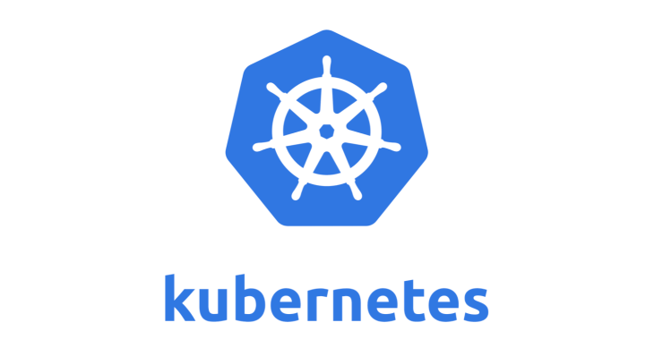

# MLStack ⇒ Kubernetes - Argo - Git - DVC - MLFlow - KServe

In this document am trying to share this side project i have been working on for past few weeks to solve some of the problmes i countered and saw in ML workflows and ML Lifecycle. This repository start all away from beginning, first by explaining why all this and what could be added to the way i was working as a data scientist. it gonna dive in each tool of this stack and why i have choosed to go with it then we gonna go implement and install everything on Minikube (minikube is **local Kubernetes**, focusing on making it easy to learn and develop for Kubernetes!) 

.jpeg)

# What are the problems that i have saw and countered building and deploying ML systems?

I have been working as a data Science Intern with SW Engineering background since for my first 3 years of university i have been studying general computer Science and Software Development. During this period i was working on End-to-End computer vision problem from collecting data to building model and deploying (i have never heard of monitroing by that time).  We were collecting image data from search engines after collecting data we usually clean it , annotate it and then start creating models and do experiments on different models and architectures based on initial results we my try different transformations or try to augment data and then we try different parameters and different experiments. after having an initial model that perform good enough on test data we try to deploy it and we were doing this in the most basic way ! we call model’s library loader inside django code and start doing running predictions after preprocessing the input data and post-processing before sending result back to user interface.

Problems i have countered and i was always frustrated with : 

- I was working with Notebooks which means i had no version controlling system starting from the scrappers that where collecting data to modeling codes. and even if we want to do the way was to create multiple version of the notebook with some very weird different names (notebook, notebook1, notebook-final, final-notebook123 ...)
- after we collect the data we need to clean it and start labeling it by selecting the bounding boxes from images and this process requires to split data for how many people will be labeling send to everyone it’s part and then receive the new data and combine everything in one place. you can imagine how many files were transferred between us during this process and how it’s really hard to keep tracking every single file and after collecting new data the same process repeat it-self but this time with old + new data. at same point i can count at least 12+ compressed file for that one problem.
- We start expirement models, different architectures and different parameters. at start i was able to create notebook for each architecture at least ! tho i was changing the parameters multiple times in same notebook and none was keeped versioned ofc neither the parameters not the result metrics. at some point it was just so hard to keep create new notebooks for each experiment so everything were in one notebook.
- Saving models for deployment was the less messy part of all process just cause i wasn’t saving the model for deployment unless i reached some good result that i thought it’s worth the save. but this part it self keep getting out of my hand after having that first good example and start creating new versions of model either to add more classes or to improve something specific.
- Our deployment methode was indeed so basic that it was the first thing we have quickly felt short and we wanted to drop it! and this is not because we actually figure out how bad it was but because we had some of right practice (DevOps) while developing Django Platform. it didn’t make sense at all for me and the full stack team to keep work on create new (Views and Templates for each new model) for how long we will be creating new version of the project just for this single improvement in this model.
- We didn’t have this one centric store where we can save everything and any of us can get what he want from so were creating this teams group chat and start sharing everything there.

> Am not saying that this problem is with every team and every start-up that works on ML/DL but am pretty sure there is some common problems that every non experienced team or individual is having! and am pretty sure that with the right practice a big part of this problems could have less impactful or even be avoided in a perfect case. i will quote from **[Laszlo Sragner](https://www.linkedin.com/in/laszlosragner/)**  something he said inèone of the [MLOps Community](https://mlops.community/) threads “MLOps is a mindset.”
> 

# Let’s Talk about everything in this stack

## First : Everything on Kubernetes

it’s really hard nowadays even for data Scientists to not hear of the K8s or kubernetes at least once as part of a project or a solution or a tool he may be utilising.

“[Kubernetes](https://kubernetes.io/docs/concepts/overview/what-is-kubernetes/), also known as K8s, is an open-source system for automating deployment, scaling, and management of containerized applications.”

### **Why K8s and what does it provide?**

- Any ML workload in production from training to deployment  require scaling up and down depend on project and usage for the model so we need a solution that targets this problematic and manage it with ease. not only that but also being able to schedule jobs to be run either based on a specific condition or specific time.
- Kubernetes is good at doing what it is made for – keeping container workloads up-and-running. in our case we have model serving that we will to run in containers eventually, so K8s will do a great job of keeping it operational and managing the container instances and pods for us.
- Adding or Integrating some Cloud Services or moving some part of the prject to cloud, maybe the whole stack can be on cloud later on

## Workflows with Argo (Pipeline and DAG’s within Kubernetes)

Machine learning is not a one-way pipeline, but an iterative loop. It includes four parts: data preprocessing, model training, model deployment and data update. Among them, the preprocessing and model training involves the adjustment of parameters while the entire ML process involves cooperation between links. There is a lot of communication work, code rewriting and environment configuration that undergoes in a machine learning process. So we will need something that will provide this flexibility and capable to create graphs ****or Dags (**[Directed acyclic graph](https://en.wikipedia.org/wiki/Directed_acyclic_graph))** This where Argo come to the picture.

### What is Argo Workflows

Argo Workflows is an **open source container-native workflow engine for orchestrating parallel jobs on Kubernetes.** Argo Workflows is implemented as a Kubernetes CRD. Model multi-step workflows as a sequence of tasks or capture the dependencies between tasks using a graph (DAG).

## Code and Dataset Versioning :

For this we will be using Git, i think there is no need to talk about why Git and where we can use it. Git is a version controller system which means we can version and controll changes in our codes by maintaining a history of all changes made to the code. 

Git is one of the most important in Software Development if not the most. And i think it should be just as important for Data Scientists. Especially if we are talking about teams. let’s see what are the main 2 things that Git offers :

### What does Git provide

- Tracking the changes and updates. We are able to see who made which changes. Git also provides when and why a change was made.
- Allowing to work collaboratively. Software development projects usually require many people to work together. Git provides the developers with a systematic way of doing that. Thus, the developers focus on the project instead of extensive communication sessions between the other developers.

### Why Not ****Git-LFS for Dataset Versioning****

- Git-LFS requires an LFS server, and that server is not available through every Git hosting service. The big three (Github, Gitlab and Atlassian) all support Git-LFS but maybe you want to setup your own Git Server.
- Another issue is the support of data files on a cloud storage system (AWS, GCP, etc) as is often required when to run cloud-based AI software. This is not supported, since the main Git-LFS offerings from the big 3 Git services store your LFS files on their server.

So as we saw Git is not recommended for Version controlling Data especially Large one! So we need some other tool that can do that, that’s when DVC comes to discussion.

Let’s dive more into DVC (Data version controllers and why we need it) 

### **So what it DVC**

Data version controller have the same paradigm as Git but for datasets instead of codes. therefore, a system that involves tracking our datasets by registering changes on a particular dataset.

### What does it provide

- DVC runs on top of any Git repository and is compatible with any standard Git server or provider (GitHub, GitLab, etc). Data file contents can be shared by network-accessible storage or any supported cloud solution. DVC offers all the advantages of a distributed version control system — lock-free, local branching, and versioning.
- it Uses Amazon S3, Microsoft Azure Blob Storage, Google Drive, Google Cloud Storage, Aliyun OSS, SSH/SFTP, HDFS, HTTP, network-attached storage, or disc to store data. The list of supported remote storage is constantly expanding.

### why this solution exaclty

I have choosed DVC exactly for it’s simplicity of use and how it has almost same commands as Git, and that’s very important cause in order to solve all problems i mentioned before we don’t need only to have right tools but also people who gonna use this tools must learn them and for data Scientists at least learning DVC after Git wouldn’t be like a new challenge cause it has same philosophy and even same commands

### How is it implemented in the stack

Git & DVC are not integrated in the stack directly but more like it a practice that data Scientists should start adopting ! first by pushing the code into a repository using any Git Server and then push the dataset to an S3 bucket that will be created already in our stack using minio

## Experiment tracking and Model Registry :

For this we will be using MLFlow, according to MLFlow website “MLflow is an open source platform to manage the ML lifecycle, including experimentation, reproducibility, deployment, and a central model registry. MLflow currently offers four components: MLFlow Tracking, MLFlow Project, MLFlow Models, Model Registry”

For me i think MLFlow is one of the best tool in MLOps world will first it’s Open Source but also for how much stuff it’s providing to Machine Lifecycle. but at the same i think that not everything in MLFlow System is good to just adopt in any use case and on of this stuff is the idea of Models and how to deploy everything with MLFlow.

### So what does actually MLFlow Provide ?

- Tracking module which is is an API and UI that is used to record parameters, performance evaluations and output files when executing machine learning codes so that they can be visualised in the future. By using a few simple lines of code, you can track parameters, performance indicators. MLflow Tracking is organized around the concept of *runs*, which are executions of some piece of data science code. Each run records information like:**Code Version, Start & End Time, Parameters, Metrics**
- The MLflow Model Registry component is a centralized model store, set of APIs, and UI, to collaboratively manage the full lifecycle of an MLflow Model. It provides model lineage (which MLflow experiment and run produced the model), model versioning, stage transitions (for example from staging to production), and annotations.

### Why MLFlow exactly

- Well it’s Open Source
- well adopted and provide more than expirement tracking but also model registry which will reduce adding more tools and configuration with model

### How is it implemented in the stack

MLFlow will be used inside the step or task containers. it’s job is either start run to track and store all parameters and metrics in a expirement. or to get the best run for a project in order to to deploy it. since MLFlow is using an Object Storage such as S3 bucket to store model artifacs we will be using the same storage later on deployment to reduce the complexity.

## Model deployment:

So after writing diffrenet codes and do expirements of different architectures and models and selecting the best model, we reach the deployment stage. we need some deployment tool that can cover all the different libraries such as Tensorflow, Pytorch, and SKLearn... it provides autoscaling and it can be managed for A/B testing and other deployment Strategies. 

> one of the other reasons why i went with kserve rather than Seldon Core or BentoML or any of the other solution is this new thing called ModelMesh, cause i think adopting everything in this stack can only be done by non small team that want to deploy a lot of models and versions. “With machine learning approaches becoming more widely adopted in organizations, there is a trend to deploy a large number of models. For example, a news classification service may train custom models for each news category. Another important reason why organizations desire to train a lot of models is to protect data privacy, as it is safer to isolate each user's data and train models separately. While you get the benefit of better inference accuracy and data privacy by building models for each use case, it is more challenging to deploy thousands to hundreds of thousands of models on a Kubernetes cluster. Furthermore, there are an increasing number of use cases of serving neural network-based models. To achieve reasonable latency, those models are better served on GPUs. However, since GPUs are expensive resources, it is costly to serve many GPU-based models.”
> 

### So what does actually KServe Provide ?

- Provides **performant, standardized inference protocol** across **ML frameworks**
- Support modern **serverless inference workload** with **Autoscaling** including **Scale to Zero on GPU**.
- Provides high scalability, density packing and intelligent routing using ModelMesh.
- Simple and Pluggable production serving for production ML serving including prediction, pre/post processing, monitoring and explainability
- Advanced deployments with canary rollout, experiments, ensembles and transformers.

### How is it implemented in the stack

Kserve in our case will be getting triggered by Argo workflows, since it will be getting all information related to the new deployment from previous step (normally retrieve-best-model step) and get model name, version, model flavor or library used to create model and finally the model URI from MLFlow (Link of the model artifact from storage)

# Let’s Try Install everything and test an example

With this installation you can conveniently run through the tutorial directly on a laptop assuming it has enough resources. It has been tested on a 4 cores machine, `x86-64`  architecture with 16GB RAM. Minikube provides a single-node local cluster, so this installation is meant just for testing purposes.